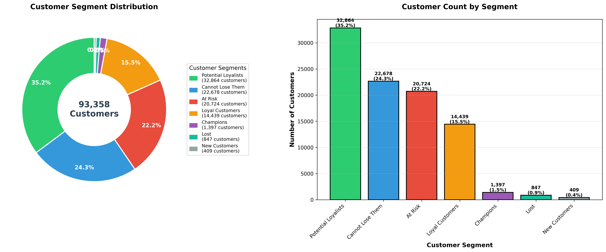
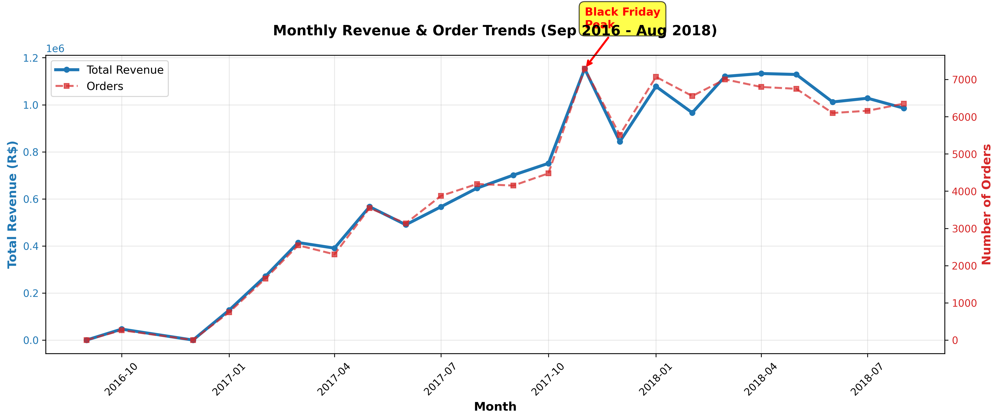
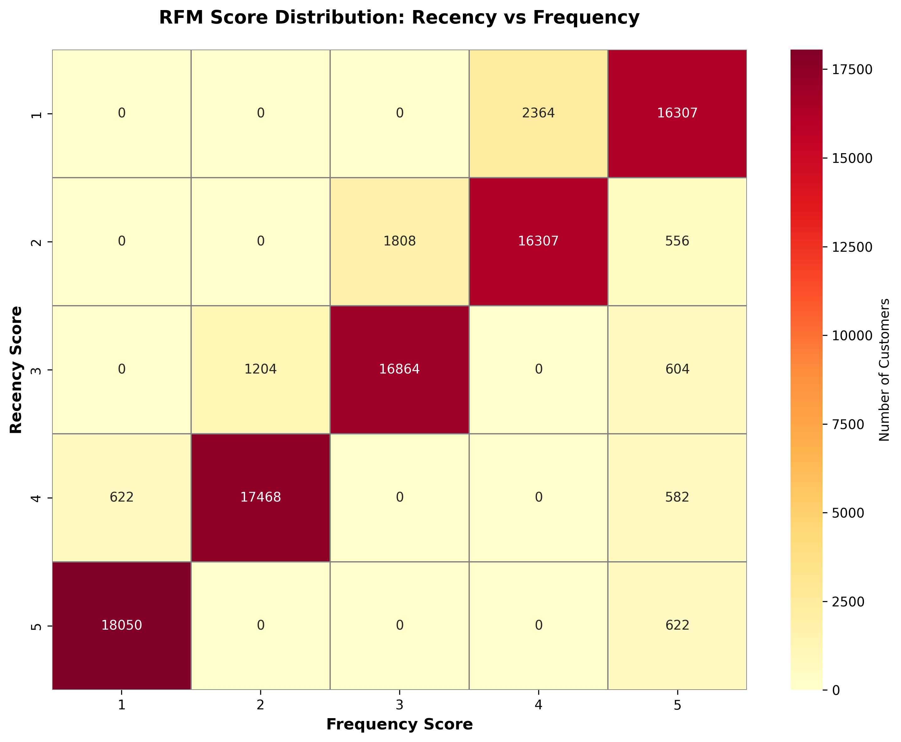

# E-Commerce Customer Analytics Pipeline (Apache Spark)


An end-to-end **PySpark** pipeline that turns **555,626 raw records across 7 relational tables** from the Olist Brazilian e-commerce marketplace into customer segments, lifetime value, churn risk, and product, seller and regional insights.

**96,478 delivered orders · 93,358 unique customers · R$ 15.4M revenue · Sept 2016 – Aug 2018**

Built for CSC1142 Data Analytics, MSc in Computing (Data Analytics), Dublin City University.

---

## Headline findings

| Metric | Value |
|---|---|
| Total revenue | **R$ 15,419,774** |
| Average order value | R$ 159.83 |
| Average review score | 4.16 / 5 |
| On-time delivery rate | 91.9% (7,826 late orders) |
| Repeat customers | 2,801 (**3.0%**, averaging 1.03 orders per customer) |
| Revenue from the top 10% of customers | 39.9% |
| Customers at high churn risk (no purchase in 180+ days) | 59.1%, holding R$ 8.95M (58%) of historical revenue |
| Largest market | São Paulo: 42% of orders, R$ 5.77M revenue |

**Takeaway:** Olist is overwhelmingly a one-purchase marketplace. Retention, not acquisition, is the biggest lever: almost 60% of historical revenue came from customers who have gone quiet.

---

## Pipeline

```
 7 raw CSVs (Kaggle)                      Spark DataFrames                       Outputs
┌──────────────────┐    ┌───────────────────────────────────────────┐    ┌──────────────────────┐
│ customers        │    │ 01 Ingestion & exploration                │    │ Parquet (processed)  │
│ orders           │ →  │    schema checks, profiling, distributions│ →  │ Customer profiles    │
│ order_items      │    │ 02 Cleaning & transformation              │    │ Product / seller /   │
│ payments         │    │    nulls, delivered-only, payment agg,    │    │ geographic tables    │
│ reviews          │    │    joins → master table, features, RFM    │    │ Visualizations (PNG) │
│ products         │    │ 03 Advanced analytics                     │    │ Executive summary    │
│ sellers          │    │    CLV, Pareto, basket, geo, sellers,     │    └──────────────────────┘
└──────────────────┘    │    churn risk                             │
                        └───────────────────────────────────────────┘
```

### Data model

```
CUSTOMERS ──< ORDERS ──< ORDER_ITEMS >── PRODUCTS
                │              │
                ├──< PAYMENTS  └──> SELLERS
                └──< REVIEWS
```

---

## What the pipeline does

**1. Ingestion and exploration** (`01_data_ingestion_exploration.ipynb`)
- Loads all 7 tables into Spark DataFrames with inferred schemas.
- Profiles order status, monthly volume, payment types and price distributions.

**2. Cleaning and transformation** (`02_data_cleaning_transformation.ipynb`)
- Runs a data-quality audit of nulls per table. For example, 2.98% of orders have no delivery date.
- Keeps only delivered orders (96,478) and classifies each as on-time or late.
- Aggregates multi-payment orders to one row per order (103,886 → 99,440).
- Joins the tables in stages into a 35-column master analytical table.
- Engineers features:
  - temporal: year, quarter, month, day of week, hour, weekend flag, time of day
  - customer-level: orders, lifetime value, recency, lifetime days
- Scores customers on recency, frequency and monetary value (RFM, 1–5 each) with Spark window functions and assigns them to 7 segments.
- Writes the results to Parquet.

**3. Advanced analytics** (`03_advanced_analytics.ipynb`)
- Monthly revenue trend and growth
- Customer lifetime value tiers and Pareto analysis
- Product performance and market basket analysis (products frequently bought together)
- Geographic analysis by state
- Seller performance ranking
- Churn-risk scoring and revenue at risk
- Executive summary

---

## Results

### Customer segments (RFM)

| Segment | Customers | Share |
|---|---|---|
| Potential Loyalists | 32,864 | 35.2% |
| Cannot Lose Them | 22,678 | 24.3% |
| At Risk | 20,724 | 22.2% |
| Loyal Customers | 14,439 | 15.5% |
| Champions | 1,397 | 1.5% |
| Lost | 847 | 0.9% |
| New Customers | 409 | 0.4% |

<p align="center">
  
</p>

### Customer lifetime value

| CLV tier | Customers | Avg CLV | Revenue |
|---|---|---|---|
| High Value | 2,582 | R$ 1,723 | R$ 2.97M |
| Medium Value | 6,016 | R$ 671 | R$ 2.69M |
| Low Value | 84,760 | R$ 173 | R$ 9.76M |

The 2.8% of customers in the high-value tier generate 19% of revenue.

### Churn risk

| Risk level | Customers | Revenue |
|---|---|---|
| High Risk | 55,132 (59.1%) | R$ 8.95M |
| Medium Risk | 19,706 (21.1%) | R$ 3.34M |
| Low Risk | 11,627 (12.5%) | R$ 2.01M |
| Active | 6,893 (7.4%) | R$ 1.11M |

### Revenue trend and geography

Order volume grew steadily through 2017 and peaked in **November 2017 (7,544 orders, Black Friday)**. The top three states account for two-thirds of all orders: SP 42.0%, RJ 12.8% and MG 11.8%.

<p align="center">
  
</p>

<p align="center">
  
</p>

---

## Why Spark?

- **Multi-table joins:** seven normalised tables are joined into one analytical table with staged joins.
- **Window functions:** used for RFM quantile scoring and ranking across 93K customers.
- **Columnar output:** processed data is written to Parquet for fast downstream reads.
- **Scales unchanged:** the same code runs on a laptop or a cluster as the data grows.

---

## Engineering challenges solved

1. **Customer identity:** Olist issues a new `customer_id` per order. Aggregating on `customer_unique_id` gives correct repeat-purchase and CLV figures.
2. **Multi-payment orders:** vouchers combined with card payments were collapsed to one row per order, so joins don't duplicate revenue.
3. **Incomplete orders:** the analysis is restricted to delivered orders, and delivery performance is computed only where both actual and estimated dates exist.
4. **Join performance:** the joins were restructured and staged, cutting runtime from over 3 minutes to under 1 minute.

---

## Getting started

**Prerequisites:** Python 3.8+, Java 11+, and 4 GB+ RAM.

```bash
git clone https://github.com/ahireniket33/E-commerce-analytics-project.git
cd E-commerce-analytics-project/ecommerce-analytics-pipeline-main/ecommerce-analytics-pipeline-main
pip install pyspark pandas matplotlib seaborn jupyter
```

1. Download the [Olist Brazilian E-Commerce dataset](https://www.kaggle.com/datasets/olistbr/brazilian-ecommerce) from Kaggle.
2. Place the 7 CSV files in `data/raw/`.
3. Run the notebooks in order: `01` → `02` → `03`.

The raw data is not included in this repository.

---

## Repository structure

```
E-commerce-analytics-project/
├── ecommerce-analytics-pipeline-main/ecommerce-analytics-pipeline-main/
│   ├── 01_data_ingestion_exploration.ipynb
│   ├── 02_data_cleaning_transformation.ipynb
│   ├── 03_advanced_analytics.ipynb
│   └── outputs/visualizations/          # revenue_trend, customer_segments, rfm_heatmap
└── food-crisis-analysis-main/           # separate project (see below)
```

### Also in this repo: Global Food Crisis Analysis (2019–2025)

This is a separate Python and Tableau project that analyses food-price inflation across 94 countries using 1.96M World Food Programme records. See [its README](food-crisis-analysis-main/food-crisis-analysis-main/README.md).

---

## Authors

- **Niket Ahire**: [LinkedIn](https://www.linkedin.com/in/niket-ahire-512178291) · [GitHub](https://github.com/ahireniket33)
- **Robert Borkar**

MSc in Computing (Data Analytics), Dublin City University.
